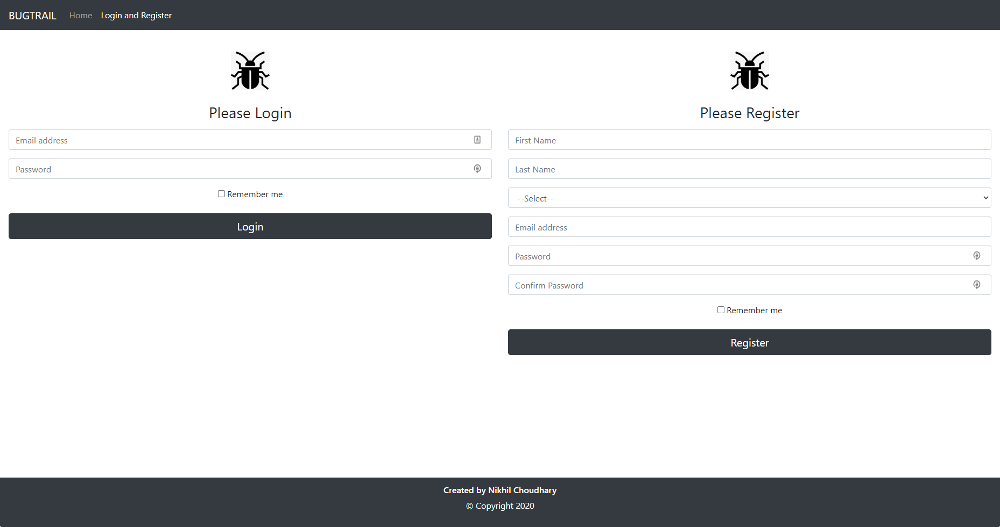
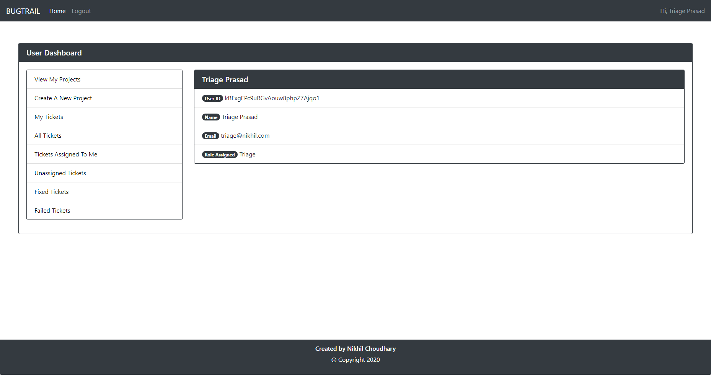
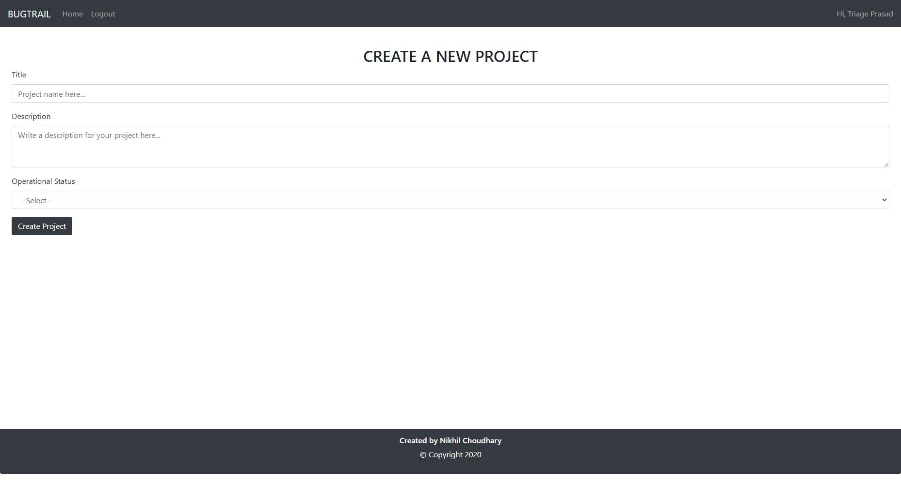
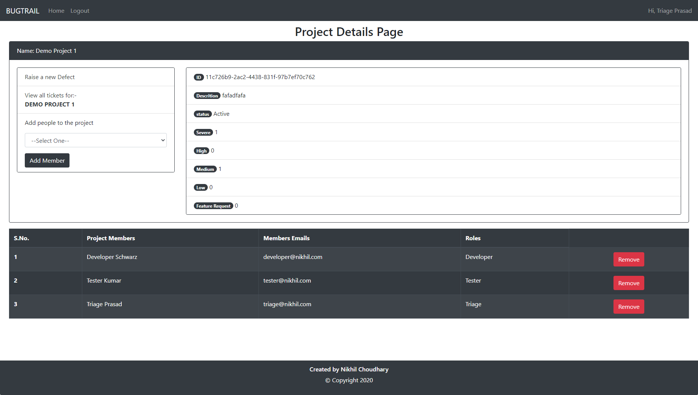
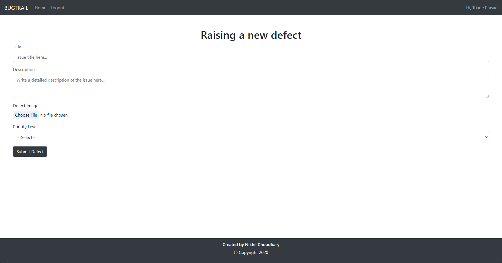
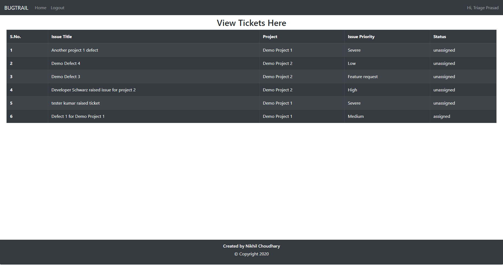
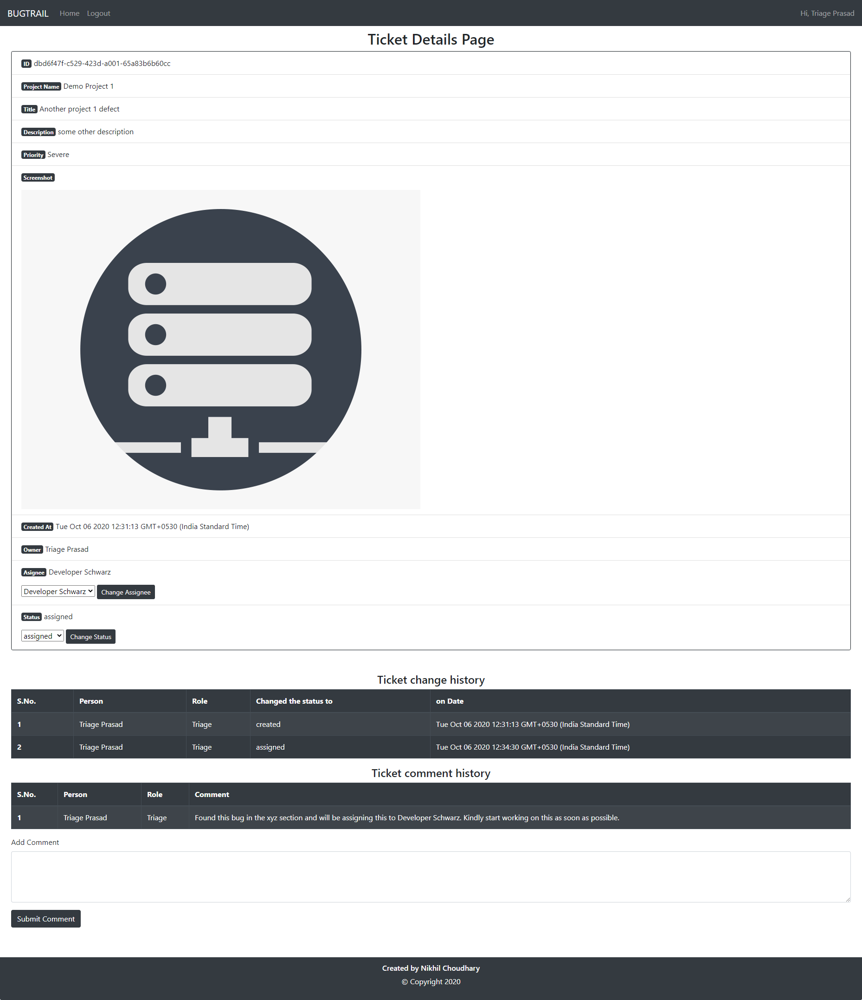

# Bugtrail - A Bug Tracking System

## A bug tracking system built using React for the front end and Firebase for the backend

## Project Screenshots:-

### Usage Instructions:-

Create an app on firebase by clicking [here](https://firebase.google.com/)
now after you receive your project's configuration, replace it with the one present in this project.
You'll find it at src/firebase/firebase.utils.ts
Once done, you'll just need to run a few commands.

#### run the following commands:-

yarn (this will create your node_modules folder and install all the project related dependencies)

yarn start (this will run the development server on your local machine on port 3000. You can visit it here [localhost:3000](localhost:3000))

You can also find a hosted version of this project [here](https://nikpydev.github.io/bugtrail-v3)
