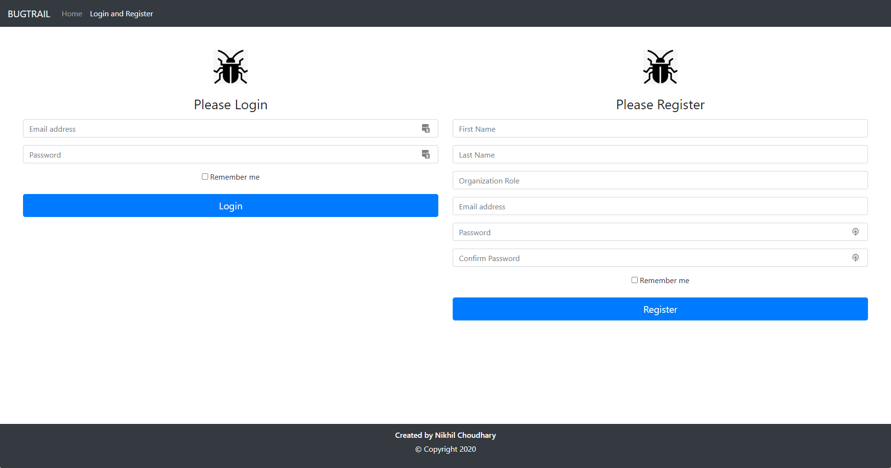
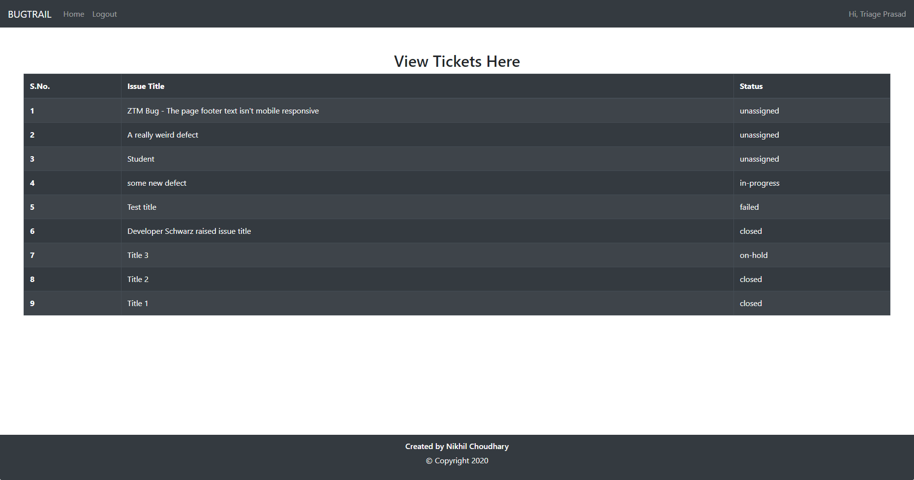
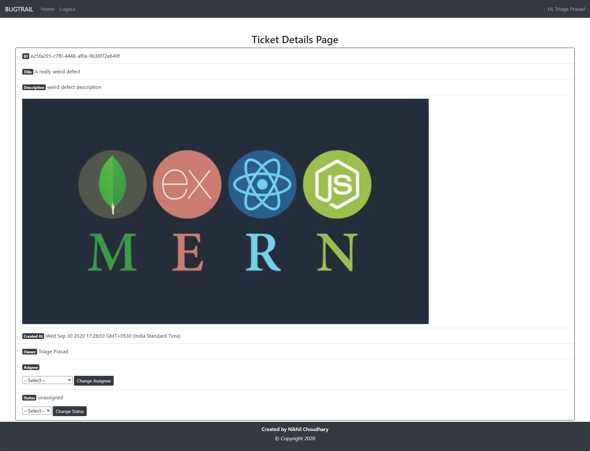

# Bugtrail - A Bug Tracking System

## A bug tracking system built using React for the front end and Firebase for the backend

## Project Screenshots:-

### Usage Instructions:-

#### run the following commands:-

yarn (this will create your node_modules folder and install all the project related dependencies)

yarn start (this will run the development server on your local machine on port 3000. You can visit it here [localhost:3000](localhost:3000))

You can also find a hosted version of this project [here](https://nikpydev.github.io/bugtrail-v3)
